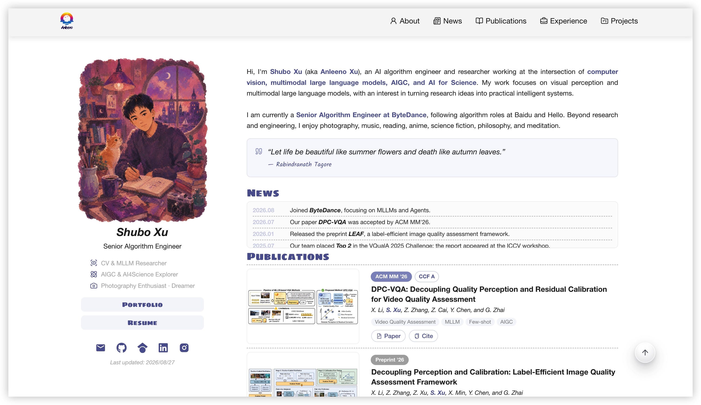

# Anleeno Academic

A responsive academic portfolio template built with React and Vite. It includes a personal profile, news, publications, professional experience, and selected projects.

Live demo: [www.anleeno.com](https://www.anleeno.com)



## Features

- Built with **React 19**, **Vite 7**, modular components, and isolated content datasets for straightforward maintenance and extension.
- Responsive CSS architecture supports desktop, iPad, and mobile layouts, with adaptive profile, navigation, timeline, and card presentation.
- Google Scholar integration includes multi-source fetching, HTML/Markdown parsing, title normalization, request timeouts, and 12-hour `localStorage` caching.
- Canvas-based logo analysis extracts representative colors at runtime to generate adaptive experience-card reflections without hard-coded presets.
- ESLint enforces code quality, while GitHub Actions provides automated Vite builds and GitHub Pages deployment.
- Scroll-aware glass navigation, smooth anchor scrolling, and a collapsible mobile menu.
- Data-driven profile, news, publication, experience timeline, and selected-project sections.
- Publication cards with abstract previews, paper links, citation copying, visual feedback, and live Scholar citation counts.
- Responsive project media with image backdrops and accessible hover/focus-to-play video previews.
- Social links, downloadable résumé, custom experience timeline, and one-click back-to-top navigation.

## Quick Start

Node.js 22 or later is recommended.

```bash
git clone https://github.com/Anleeno/anleeno-academic.git
cd anleeno-academic
npm install
npm run dev
```

Other commands:

```bash
npm run build
npm run preview
npm run lint
```

## Customize

Most site content can be updated from these files:

| Content | File |
| --- | --- |
| Profile and social links | `src/components/Hero.jsx` |
| Biography | `src/components/About.jsx` |
| News | `src/data/news.js` |
| Publications | `src/data/publications.js` |
| Experience | `src/data/experience.js` |
| Projects | `src/data/projects.js` |
| Images, résumé, logos, and video | `src/assets/` |

Replace the Google Scholar profile URL in `src/utils/scholarCitations.js` if you want to display citation counts. The integration is optional and silently falls back when citation data is unavailable.

Large media files can increase deployment time and visitor bandwidth usage. For a reusable fork, consider replacing or externally hosting the included project video.

## Deployment

The included GitHub Actions workflow deploys the `main` branch to GitHub Pages.

1. Open **Settings → Pages** in your repository.
2. Select **GitHub Actions** as the source.
3. Push to `main`.

For a custom domain, replace or remove `public/CNAME` and configure the same domain in the repository Pages settings.

## License

No open-source license is currently granted for this repository.

Unless otherwise stated, all personal content and media assets—including photographs, illustrations, profile information, résumé materials, publication figures, project images, videos, logos, and branding—are © Shubo Xu. All rights reserved. These materials may not be copied, modified, redistributed, or used in derivative works without prior written permission.

Rights to code and materials originating from third-party projects remain with their respective copyright holders.

## Acknowledgements

This project is derived in part from [LucyLing24/longling](https://github.com/LucyLing24/longling).
